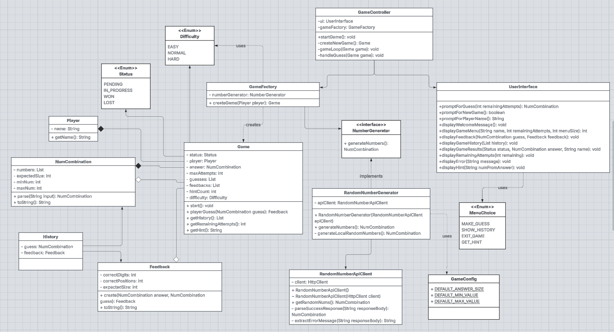

# Mastermind CLI Game

A Java-based implementation of the classic Mastermind guessing game with a command-line interface. Players choose from three difficulty levels and attempt to crack secret number combinations within 10 attempts, receiving strategic feedback and optional hints after each guess. The game integrates with Random.org's [API](https://www.random.org/clients/http/api/) for truly random number generation and includes comprehensive error handling with local fallback.

## Table of Contents
- [Demo / TL;DR](#demo--tldr)
- [Quick Start](#quick-start)
- [How to Play](#how-to-play)
- [Architecture Overview](#architecture-overview)
- [UML Diagram](#uml-diagram)
- [Key Features](#key-features)
- [Testing & CI](#testing--ci)
- [Design Choices](#design-choices)
- [Planning](https://trello.com/b/6MPl0smI/reach-mastermind)

---

## Demo / TL;DR

```bash
git clone https://github.com/joe-bor/mastermind.git
cd mastermind
chmod +x run.sh
./run.sh
```

Enter guesses like: `0 1 3 5`  
The game prints feedback after each guess and ends when you guess correctly or run out of attempts.

## Quick Start

**Prerequisites**

* Java JDK 23 (tested on OpenJDK 23)
* Unix-like shell (macOS / Linux) or Windows with bash (or use `gradlew.bat`)
* Internet connection (optional, only for Random.org; the game works offline via fallback RNG)

**Clone & Run**

```bash
git clone https://github.com/joe-bor/mastermind.git
cd mastermind
chmod +x run.sh   # one-time on Unix-like systems
./run.sh
```

**Developer build & tests**

```bash
# Build + tests
./gradlew build

# Run tests only
./gradlew test

# Run from compiled classes (developer)
./gradlew compileJava
java -cp build/classes/java/main com.mastermind.Main
```

## How to Play

**Choose Your Difficulty:**

| Difficulty | Numbers | Range | Description |
|------------|---------|-------|-------------|
| **EASY** | 3 | `0-5` | Beginner-friendly |
| **NORMAL** | 4 | `0-7` | Classic Mastermind |
| **HARD** | 5 | `0-9` | Advanced challenge |

**Game Rules:**
* You have **10 attempts** to guess the secret combination
* Enter guesses as **numbers separated by spaces** (example: `1 2 3 4`)
* **Hint System** — Request hints to reveal one correct digit and position
* After each guess you receive feedback:
    * `All correct` — all digits match in correct positions (you win)
    * `All incorrect` — no digits match
    * `X correct numbers, and Y correct location` — `X` digits appear in the secret (regardless of position), and `Y` of them are in the exact positions

**Example Gameplay:**

```
========================================
           MASTERMIND - GAME MENU
========================================
Remaining attempts: 10

Choose an option:
1. Make a guess
2. Show game history
3. Exit game
4. Get a hint

Enter your choice (1-4): 1
Enter your guess (10 attempts remaining): 0 1 2 3
Your guess: 0 1 2 3
Result: 3 correct numbers, and 0 correct location

---

Enter your guess (8 attempts remaining): 1 2 3 4
Your guess: 1 2 3 4
Result: All correct


========================================
          * * * CONGRATULATIONS! * * *
                 YOU WON!

The secret combination was: 1 2 3 4
========================================
```

## Architecture Overview

This project follows a layered, testable design with clean separation of concerns:

### Dependency Injection Chain
```
Main.java
└── GameController(UserInterface, GameFactory)
    ├── UserInterface → MenuChoice enum
    └── GameFactory(NumberGenerator)
        └── RandomNumberGenerator(RandomNumberApiClient)
            └── RandomNumberApiClient(HttpClient)
```

**Key Design Patterns:**
* **Strategy Pattern** - `NumberGenerator` interface for swappable generation strategies
* **Factory Pattern** - `GameFactory` for controlled game creation with difficulty support
* **Value Objects** - `NumCombination`, `History`, `Difficulty` for type-safe, validated data
* **State Machine** - `Game` with `Status` enum for game flow management
* **Enum-based Configuration** - `Difficulty` and `MenuChoice` enums for type safety

## UML Diagram



**Interactive UML Diagram:** [View on Lucidchart](https://lucid.app/lucidchart/a40e0c64-6a5f-4d20-90f3-e96d7f64f470/edit?viewport_loc=3500%2C-2084%2C3549%2C1848%2CHWEp-vi-RSFO&invitationId=inv_e41122a2-634c-495f-aa46-f724465e41af)

The diagram illustrates the complete architecture including the new difficulty system, hint functionality, and all domain models with their relationships.

## Key Features

**Development Timeline:**
1. **Base Requirements Complete** ([PR #10](https://github.com/joe-bor/mastermind/pull/10)) - Fully playable Mastermind game
2. **Enhanced Features:**
   - **Hint System** ([PR #14](https://github.com/joe-bor/mastermind/pull/14)) - Smart hint functionality with usage tracking
   - **Difficulty Levels** ([PR #15](https://github.com/joe-bor/mastermind/pull/15)) - Easy (3 digits, 0-5), Normal (4 digits, 0-7), Hard (5 digits, 0-9)
   - **Enhanced UI** ([PR #13](https://github.com/joe-bor/mastermind/pull/13)) - Personalized interface with improved navigation
   - **CI/CD Pipeline** ([PR #11](https://github.com/joe-bor/mastermind/pull/11)) - Automated testing workflow

**Technical Features**
- **Resilient API Integration** - Random.org API with retry logic and local fallback
- **Type-Safe Architecture** - Strong typing with custom enums and value objects
- **Comprehensive Testing** - Unit tests with GitHub Actions CI/CD
- **Clean Architecture** - SOLID principles with dependency injection throughout

## Testing & CI

* Unit tests and integration tests live under `src/test/java`.
* The test suite covers:
    * All scoring scenarios, including duplicates and edge-cases
    * API client behavior via mock HTTP responses
    * Error scenarios (timeouts, malformed responses)
    * CLI input validation
* Run tests locally: `./gradlew test`
* CI: a GitHub Actions workflow runs the same test suite on every push

### External Dependencies
- **Random.org API** - True random number generation
- **No external runtime dependencies** - Completely self-contained application

---

## Design Choices

**NumCombination as Central Domain Model**
- Chose strong typing over primitive collections for type safety and validation
- Encapsulates parsing logic for user input with comprehensive error messages
- Immutable design prevents accidental state modification

**Resilient External API Integration**
- 3-attempt retry logic with exponential backoff for Random.org API
- Graceful degradation to local `java.util.Random` when API unavailable
- Custom `RandomNumberApiException` for clear error semantics
- 10-second HTTP timeouts prevent hanging

**Feedback Algorithm with Duplicate Handling**
- Two-pass algorithm: exact position matches first, then remaining digit matches
- Frequency-based scoring using `Math.min(answerCount, guessCount)` for proper duplicate handling
- Handles complex scenarios like answer "1 1 2 3" vs guess "1 1 1 2"

**Strategy Pattern for Number Generation**
- `NumberGenerator` interface allows swapping between API-based and local number generation
- Enables clean dependency injection and comprehensive testing
- Fully supports configurable difficulty levels with different number ranges

**Factory Pattern with Difficulty Integration**
- `GameFactory` encapsulates game creation complexity with difficulty-aware instantiation
- Single responsibility: handles number generation coordination based on chosen difficulty
- Enables controlled instantiation with proper dependency injection

**Hint System Architecture**
- `Game.getHint()` method provides strategic hint delivery without compromising game integrity
- Uses `Optional<String>` for clean null-safe hint handling
- Integrates seamlessly with existing game state and menu system

**Difficulty System Design**
- `Difficulty` enum encapsulates combination size and number range per difficulty level
- Type-safe difficulty selection with `fromValue()` method for menu integration
- Immutable configuration prevents runtime modification of game parameters

---

*REACH Backend Challenge August 2025.*